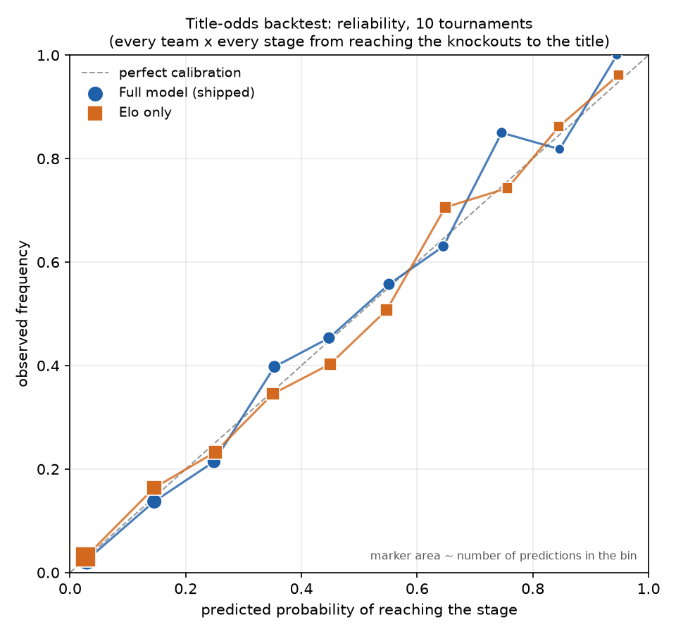

# WORLDCUP-2026

## TL;DR

This project forecasts 2026 World Cup matches and simulates who wins the tournament. It has three parts, and the evidence behind each is different.

1. **Match forecast, frozen before the tournament and scored on 68 real games.** Each match gets a 90-minute home/draw/away probability from an ensemble of Elo, a Dixon-Coles Poisson model and a multinomial logit. Its walk-forward log-loss is 0.9024 on about 49k past matches, against 1.0510 for the base rate. On the 68 group games played after the forecast commit it scored 0.8851, against 0.9176 for Elo alone and 1.0986 for a uniform prior. A paired bootstrap cannot tell the edge over Elo from zero; the margin over the uniform prior is clear. See [How it actually did](#how-it-actually-did).
2. **Title odds, backtested on 10 past tournaments.** The tournament simulator was run on World Cups 2006-2022 and Euros 2008-2024, under a protocol committed before any result existed. Each run used only data from before that tournament. The model settings, though (rho, ensemble weight, temperature and the Elo constants), were tuned or set by hand on a history that includes these ten tournaments. On the pre-registered primary metric (RPS over the stage each team reached) it has a small edge over Elo alone: 0.1069 against 0.1100, a difference of −0.0031, 95% CI [−0.0058, −0.0005]. With only 10 tournaments, that is borderline. On the log score of the actual champion the two are not distinguishable. The FIFA-ranking blend adds nothing measurable. Both beat a uniform model by a wide margin. See [Title odds backtest](#title-odds-backtest).
3. **The 2026 winner table is a retrospective illustration.** It was built in September 2026, after the tournament, from data holding no result after 11 June, but with design choices made in hindsight. See [2026 title odds](#2026-title-odds-a-retrospective-illustration).

Provenance: the forecast's 13 June date rests on local git metadata that no server saw before 18 September. The real guarantee is that its inputs contain no result after 11 June. See [The frozen forecast](#the-frozen-forecast) and [docs/PROVENANCE.md](docs/PROVENANCE.md).

Match-outcome prediction for the 2026 FIFA World Cup. The target is the **3-way 90-minute result** — `0 = away win`, `1 = draw`, `2 = home win` — for the ~70 unplayed fixtures in `data/raw/results.csv`. The score itself is not modelled as an output; goals are only an intermediate quantity.

One consistent label is used everywhere, knockouts included: a tie at 90' is a draw, with no extra time or penalties. That keeps the backtest and the final output on the same definition.

## Setup

```bash
pip install -r requirements.txt
python run_pipeline.py
```

`run_pipeline.py` runs every step below from the repo root except `11` and `12`, and writes `data/power_rankings.csv`, `data/fixture_predictions.csv`, `data/tournament_sim.csv` and the title-odds backtest outputs (`data/tournament_backtest.csv`, `data/tournament_backtest_teams.csv`, `figures/tournament_calibration.png`).

**It does not touch `data/predictions.csv`.** That file is the **frozen forecast** (see below).

Any step can also be run on its own from the repo root:

```bash
python src/08_fixture_predictions.py
python src/10_tournament_sim.py 20000      # optional: number of simulations
```

Tests:

```bash
pip install -r requirements-dev.txt
pytest
```

`requirements-lock.txt` pins the exact versions CI installs (Python 3.13). That environment passes every test and regenerates the backtest outputs byte for byte:

```bash
python3.13 -m venv .venv && .venv/bin/pip install -r requirements-lock.txt
```

## Pipeline (src/)

Run in order from the repo root. `harness.py`, `step2_dixoncoles.py`, `step3_classifier.py` and `eval_baseline.py` are deliberately **not** number-prefixed: they are imported as modules by the later stages, and `import 08_foo` is a syntax error in Python.

| # | Script | Reads | Writes |
|---|---|---|---|
| 1 | `01_load_clean.py` | `data/raw/results.csv`, `former_names.csv` | *(report only)* |
| 2 | `02_elo.py` | `data/raw/results.csv` | `data/processed_matches.csv` |
| 3 | `03_elo_baseline.py` | `data/processed_matches.csv` | *(report only)* |
| 4 | `04_features.py` | `data/processed_matches.csv` | `data/features.csv` |
| 5 | `05_model.py` | `data/features.csv` | `data/build/poisson_model.joblib` (git-ignored refit; the committed `data/poisson_model.joblib` is frozen) |
| — | `eval_baseline.py` | `data/features.csv` | *(report only)* — the number to beat |
| — | `harness.py` | `data/features.csv` | *(report only)* — walk-forward evaluator |
| — | `step2_dixoncoles.py` | `data/features.csv` | *(report only)* — sweeps Dixon-Coles `rho` |
| — | `step3_classifier.py` | `data/features.csv` | *(report only)* — **the winning model** |
| 6 | `06_simulate.py` | `results.csv`, `data/build/poisson_model.joblib` | *(report only)* |
| 7 | `07_blend_predict.py` | `results.csv`, `fifa_ranking_2026-06-11.csv`, `data/build/poisson_model.joblib` | `data/power_rankings.csv` |
| 8 | `08_fixture_predictions.py` | `features.csv`, `results.csv`, FIFA ranking | `data/fixture_predictions.csv` |
| 10 | `10_tournament_sim.py` | `features.csv`, `results.csv`, FIFA ranking | `data/tournament_sim.csv` |
| 11 | `11_score_tournament.py` | `predictions.csv`, `wc26_actual_results.csv` | *(report only)* — scores the frozen forecast |
| 12 | `12_blend_backtest.py` | `features.csv`, `data/raw/fifa_ranking_history.csv` | `data/blend_backtest.csv` — walk-forward of the FIFA blend |
| 13 | `13_backtest_tournaments.py` | `results.csv`, `features.csv`, `shootouts.csv`, FIFA ranking history | `data/tournament_backtest.csv`, `data/tournament_backtest_teams.csv`, `figures/tournament_calibration.png` — title odds on 10 past tournaments |

What each output is:

- **`data/power_rankings.csv`** — one row per team: expected points across the remaining fixtures, Elo, FIFA-equivalent Elo and the blend weight. A standings-style view, not per-match probabilities.
- **`data/fixture_predictions.csv`** — one row per fixture: `p_home` / `p_draw` / `p_away` from the Step-3 ensemble, with no team-news overlay.
- **`data/predictions.csv`** — the headline output, and **frozen**. Its `p_*_pre` columns are the forecast; its `p_*_post` columns are a later team-news annotation, reported only as a secondary line. See [The frozen forecast](#the-frozen-forecast).
- **`data/tournament_sim.csv`** — one row per team: probability of winning the group, qualifying, and reaching each knockout round through `champion`.

## Method

Each side's expected goals come from a **stacked Poisson regression** (one row per attacking side) on Elo differential, attack/opponent-defence form and home advantage. The score grid is corrected with the **Dixon-Coles** low-score adjustment (`rho = -0.15`, chosen by sweeping held-out log-loss), which lifts the 0-0 and 1-1 cells, then collapsed into W/D/L.

That Poisson + Dixon-Coles model is **both the baseline and a component of the final model**, not the final model itself. The predictions in `fixture_predictions.csv` and `predictions.csv` come from the **Step-3 ensemble** in `step3_classifier.py`: a multinomial logistic classifier that predicts the 3-way label *directly*, blended **0.3 Poisson/Dixon-Coles + 0.7 logistic** and temperature-calibrated (`T = 0.95`).

Walk-forward log-loss (5-fold, ~49k matches — lower is better):

| Model | log-loss |
|---|---|
| Naive base rate | 1.0510 |
| Poisson (`rho = 0`) | 0.9120 |
| Poisson + Dixon-Coles (`rho = -0.15`) | 0.9091 |
| Multinomial logistic alone | 0.9033 |
| **Step-3 ensemble (final)** | **0.9024** |

Most of the gain comes from predicting the 3-way label directly rather than from the Dixon-Coles correction, which is worth only ~0.003 on its own.

### The FIFA-ranking blend

The table above scores the ensemble fed **raw Elo**. The forecast did not feed it raw Elo. `08_fixture_predictions.py` and `10_tournament_sim.py` keep the models trained on raw Elo, but at prediction time they replace each World Cup team's Elo with a mix of Elo and the FIFA ranking:

- FIFA points are mapped onto the Elo scale by a least-squares line fitted over the 48 teams;
- `strength = (1 - w) * elo + w * fifa_elo`, with `w = clip(10 / (10 + recent), 0.2, 0.6)` and `recent` the team's matches since June 2022.

Those weights were set by hand and never tested, so the 0.9024 did not cover the model that produced the forecast. `src/12_blend_backtest.py` runs the blend through the same 5-fold walk-forward, using every FIFA release from December 1992 to September 2024. The models are still trained on raw Elo. Each test match uses the latest release before its date, if it is at most a year old. The FIFA-to-Elo line is fitted per match date over that release's top 48 teams, and the blend is applied to those teams only. Top 48 of a release is a stand-in for the 48 World Cup teams, not the same set: the World Cup field includes teams ranked well outside the top 48.

**The top-48 set and the shipped weight rule were fixed before any result was seen**, because they mirror what `08` does. Every other variant below is sensitivity and was not chosen from.

**Result: neutral to slightly positive.** The one subset with a clear effect is the 5,266 test matches where both teams were blended: 1.0116 → 1.0104, a gain of 0.0012.

All rows are pooled per-match log-loss, with a paired-bootstrap 95% interval for (blended − raw) on the same matches. The five test folds are the same size, so pooling gives the same 0.9024 as the fold average in the table above.

| Test matches | n | raw Elo | shipped blend | blended − raw, 95% CI |
|---|---|---|---|---|
| All | 41,170 | 0.9024 | 0.9022 | −0.0002 [−0.0004, −0.0000] |
| With a FIFA release under a year old | 29,972 | 0.8901 | 0.8899 | −0.0003 [−0.0005, −0.0000] |
| **Both teams blended** | **5,266** | **1.0116** | **1.0104** | **−0.0012 [−0.0022, −0.0002]** |
| … major-tournament finals | 1,167 | 0.9937 | 0.9917 | −0.0019 [−0.0043, +0.0003] |
| … release before Aug 2018 | 4,213 | 1.0137 | 1.0126 | −0.0011 [−0.0022, +0.0000] |
| … release from Aug 2018 | 1,053 | 1.0029 | 1.0013 | −0.0016 [−0.0037, +0.0006] |

- **The "All" row is diluted by design.** 27% of test matches have no release under a year old: all of fold 1 (1970–88) and part of fold 2 predate the first ranking, and the history ends in September 2024. Most of the rest involve at least one team outside the top 48, which the blend leaves alone. Its 0.0002 is the 5,266-match effect spread thin, not an independent finding.
- **The gain does not come from one ranking method.** FIFA changed its method in August 2018. Refitting the line per release absorbs the change of scale. The gain is similar before (−0.0011) and after (−0.0016); neither half is significant alone.
- **The hand-set rule adds nothing over a constant.** `w = 0.2` scores the same on every subset. `w = 0.6` is no better than raw Elo.
- **The team set matters.** Fitting and applying the line over every ranked team, instead of the top 48, removes the gain: 0.8908 → 0.8911 on 27,912 matches, +0.0004 [−0.0004, +0.0012].

The weights stay as they were, because the frozen forecast was produced with them.

On the 68 scored World Cup games (post hoc), the frozen forecast scores 0.8851 and the same model with the blend off scores 0.8934. The difference is −0.0083, 95% CI [−0.0188, +0.0017], not distinguishable from zero.

Every number above is in `data/blend_backtest.csv`. The ranking history is `data/raw/fifa_ranking_history.csv`, a third-party compilation ([`Dato-Futbol/fifa-ranking`](https://github.com/Dato-Futbol/fifa-ranking), commit `6916929`) rather than an official FIFA export.

### How it actually did

The tournament has since been played, so the frozen forecast can be scored against real results. `src/11_score_tournament.py` scores the `p_*_pre` columns against `data/raw/wc26_actual_results.csv` over the **68** group-stage fixtures that kicked off after the forecast was committed (the two 12 June fixtures are excluded — see [Leakage caveats](#leakage-caveats)).

| Model | log-loss ↓ | 95% CI (marginal) | Brier ↓ | accuracy |
|---|---|---|---|---|
| **Frozen forecast (`p_*_pre`)** | **0.8851** | [0.7654, 1.0122] | 0.5248 | 0.618 |
| Elo-only logistic (the `03` baseline) | 0.9176 | [0.7873, 1.0556] | 0.5538 | 0.618 |
| Uniform 1/3 (ln 3) | 1.0986 | — | 0.6667 | n/a |
| *post-news annotation (`p_*_post`), secondary* | *0.8876* | *[0.7663, 1.0161]* | *0.5258* | *0.618* |

Uniform accuracy is n/a: argmax over a three-way tie is arbitrary.

**Paired bootstrap** (10,000 resamples, seed 20260613). Comparing two models by whether their marginal intervals overlap is the wrong test — both models are scored on the same fixtures and rise and fall together on them. Resampling the same fixture indices for both and taking the mean per-fixture log-loss difference cancels that shared difficulty:

| Comparison | mean difference | 95% CI | verdict |
|---|---|---|---|
| Forecast − Elo-only | **−0.0325** | [−0.0753, +0.0099] | spans 0 — not distinguishable |
| post-news − pre-news | +0.0025 | [−0.0015, +0.0077] | spans 0 — not distinguishable |

**Neither difference is established.** The forecast's 0.0325 edge over the Elo-only baseline is in its favour and the paired interval is far tighter than the marginal ones, but it still crosses zero (upper bound +0.0099), so on 68 fixtures the model is not shown to beat Elo alone. The news annotation's effect is likewise indistinguishable from zero, and its point estimate is slightly *worse*.

Against the uniform prior the margin is not in doubt: 0.8851 vs 1.0986, with 61.8% of the 68 results called correctly.

**Calibration.** Marginal outcome rates match the predicted rates closely — predicted home 0.447 / draw 0.236 / away 0.317 against actual home 0.441 / draw 0.279 / away 0.279. The 19 observed draws against roughly 16 expected is within one standard deviation (about 3.5), so it is not evidence of a draw bias either way.

**Sensitivity.** Dropping the four 13 June fixtures as well — the ones sharing a date with the commit, kept in the headline because they kicked off hours after it — leaves **n = 64**, log-loss **0.8667**, Brier 0.5110, accuracy 0.641, and a paired forecast − Elo-only difference of **−0.0364, 95% CI [−0.0799, +0.0065]**. The conclusion is unchanged: slightly better, still not distinguishable.

**On comparing with the 0.9024 backtest.** The tournament figure is nominally better (0.8851), but the two are not on the same footing: the walk-forward number averages over ~49k mostly-lopsided friendlies and qualifiers, while these are World Cup group games between closely matched sides. The fixture mixes differ, so the absolute log-loss levels are not directly comparable, and n = 68 is small regardless. The fair summary is that the model performed in line with expectations, not that it beat its backtest.

## Title odds backtest

The 2026 title odds further down come from a simulator written in September 2026, after the tournament. On their own they are an illustration, not evidence. To test the simulator, `src/13_backtest_tournaments.py` runs it blind on ten past tournaments: the World Cups of 2006, 2010, 2014, 2018 and 2022, and the Euros of 2008, 2012, 2016, 2020 (played in 2021) and 2024.

**The protocol was fixed first.** [`docs/BACKTEST_PROTOCOL.md`](docs/BACKTEST_PROTOCOL.md) sets out the tournaments, cutoffs, models, metrics, seeds and the decision rule. It was committed (`14f174e`) before any backtest code existed, and nothing was changed after the results came in. There are no deviations.

**How each tournament is run.**

- The model sees only matches strictly before the day before kickoff. Elo is replayed on those matches, the Step-3 ensemble is refit on them, and the FIFA blend uses the latest ranking release before the cutoff.
- The simulator plays the real groups and then the official bracket. For the Euros from 2016 on, that includes UEFA's third-place allocation tables: one for 2016, another shared by 2020 and 2024, both transcribed from UEFA's regulations.
- A host gets home advantage only in a match played in its own country. Every other match is neutral.
- Each model gets 10,000 simulations, all from the same seed.

**How the result is checked.** Each team's actual stage comes from `results.csv`, with `shootouts.csv` settling knockouts decided on penalties. Tests confirm that every configured bracket, fed the real group standings, reproduces every real knockout match at its real venue.

Four models go through the same simulator:

- the **full model** that shipped (Step-3 ensemble, Elo blended with the FIFA ranking);
- the same model with **no FIFA blend**;
- **Elo only** (the logistic regression from `03_elo_baseline.py`, on raw Elo);
- **uniform**, where every match is a third each way.

Lower is better for all three metrics. Intervals are 95% paired-bootstrap intervals over whole tournaments. With only 10 tournaments they are wide, and a percentile bootstrap on so few clusters, if anything, understates the uncertainty.

| Model | RPS (primary) | −ln P(actual champion) | Brier, reached semi-final |
|---|---|---|---|
| **Full model (shipped)** | **0.1069** [0.0983, 0.1162] | **2.128** [1.676, 2.579] | **0.1046** [0.0852, 0.1272] |
| No FIFA blend | 0.1072 [0.0979, 0.1170] | 2.123 [1.654, 2.589] | 0.1043 [0.0839, 0.1277] |
| Elo only | 0.1100 [0.0993, 0.1214] | 2.219 [1.756, 2.673] | 0.1091 [0.0868, 0.1342] |
| Uniform | 0.1359 [0.1297, 0.1421] | 3.244 [3.072, 3.400] | 0.1339 [0.1171, 0.1528] |

| Paired difference | RPS | −ln P(champion) | Brier, semi-final |
|---|---|---|---|
| Full − Elo only | **−0.0031 [−0.0058, −0.0005]** | −0.091 [−0.326, +0.128] | −0.0045 [−0.0099, −0.00002] |
| Full − no FIFA blend | −0.0003 [−0.0010, +0.0004] | +0.006 [−0.050, +0.051] | +0.0003 [−0.0008, +0.0015] |
| Full − uniform | −0.0290 [−0.0344, −0.0241] | −1.116 [−1.535, −0.712] | −0.0294 [−0.0404, −0.0171] |

As a secondary figure, resampling teams instead of tournaments gives full − Elo only = −0.0025 [−0.0051, +0.0001] on RPS (n = 264). That interval treats teams as independent, which they are not, since only one team per tournament can win.

Tournament by tournament, for the full model:

| Tournament | Champion | P(title), full (rank) | P(title), Elo only | Full model's favourite | RPS full | RPS Elo only |
|---|---|---|---|---|---|---|
| World Cup 2006 | Italy | 3.6% (9th) | 4.7% | Brazil 17.7% | 0.0939 | 0.0933 |
| World Cup 2010 | Spain | 26.7% (1st) | 17.5% | Spain 26.7% | 0.0899 | 0.0903 |
| World Cup 2014 | Germany | 9.9% (3rd) | 10.5% | Brazil 50.3% | 0.0956 | 0.0954 |
| World Cup 2018 | France | 5.0% (7th) | 6.4% | Brazil 32.9% | 0.1055 | 0.1111 |
| World Cup 2022 | Argentina | 26.2% (2nd) | 27.6% | Brazil 34.1% | 0.1009 | 0.1003 |
| Euro 2008 | Spain | 13.1% (3rd) | 8.0% | Germany 19.9% | 0.1346 | 0.1415 |
| Euro 2012 | Spain | 42.7% (1st) | 39.1% | Spain 42.7% | 0.1260 | 0.1335 |
| Euro 2016 | Portugal | 7.6% (5th) | 3.3% | France 29.0% | 0.1200 | 0.1314 |
| Euro 2020 | Italy | 9.5% (5th) | 8.4% | Belgium 22.8% | 0.0923 | 0.0942 |
| Euro 2024 | Spain | 11.2% (4th) | 17.2% | France 17.5% | 0.1106 | 0.1086 |



The chart pools every team's probability of reaching each stage, from the knockouts to the title, over all ten tournaments. Both models sit close to the diagonal. The bins above 0.7 hold 22 to 40 predictions each, so their wobble is within noise. The uniform model is left off the chart because it is calibrated by construction: every team gets the share of teams that reach each stage. Calibration alone therefore cannot separate these models; RPS and the log score can.

**Verdict.**

- **Against Elo only, narrowly yes on the primary metric.** Under the pre-registered rule, the full model beats Elo only: the RPS interval lies wholly below zero. The margin is small, about 3% of the score. The full model wins in 6 of the 10 tournaments, and the upper end of the interval sits close to zero. On the log score of the actual champion, the two are not distinguishable. The semi-final Brier points the same way as RPS, but only just.
- **The FIFA-ranking blend is not the source of the edge.** The full model and the no-blend model are indistinguishable on all three metrics, which agrees with the blend's match-level backtest. The edge over Elo only comes from the ensemble around Elo: form, home advantage and the draw-aware classifier. This backtest does not separate those three. Elo only has no home feature, so part of the gap may be host advantage.
- **Against uniform, clearly yes on every metric.**

**Post hoc, not pre-registered.** These two readings were added after the results and are not part of the protocol.

- The full model beats Elo only on RPS in 6 of the 10 tournaments. If the two models were equally good, the chance of 6 or more wins would be 386/1024 ≈ 0.38, so the tournament-by-tournament record gives no evidence on its own.
- The champion log score has an intuitive reading: exp(−score) is the geometric mean of the probability each model gave the eventual champion. That is 0.119 for the full model and 0.039 for the uniform model (Elo only 0.109, no FIFA blend 0.120).

**What this does and does not show.**

- The model's hyperparameters (W = 0.3, T = 0.95, rho = −0.15) were chosen on a walk-forward over the whole match history, which includes these ten tournaments. The Elo settings and the blend weights were set by hand by someone who knew that history. Refitting per tournament removes parameter leakage, but not that selection.
- The simulator simplifies group tiebreaks: no head-to-head and no fair play.
- A host's home flag applies in every match in its own country. That is how Brazil became a 50% favourite in 2014.
- The 2026 path's approximate round-of-32 seeding has no historical equivalent, so it is not covered by this backtest.

Every number here is in `data/tournament_backtest.csv`, and the per-team probabilities are in `data/tournament_backtest_teams.csv`. Re-running the script reproduces both byte for byte.

## 2026 title odds: a retrospective illustration

**Built after the tournament.** This table was produced in September 2026 by a simulator written then. Its inputs contain no tournament result, but its design was chosen with hindsight (see [Leakage caveats](#leakage-caveats)). Read it as an illustration of the model, not as a forecast. The evidence for the simulator is the [backtest above](#title-odds-backtest).

The rest of the pipeline stops at per-fixture win/draw/loss probabilities. `src/10_tournament_sim.py` plays the whole 2026 bracket out 20,000 times with the Step 3 ensemble model, to turn those into P(reaches this round) and P(lifts the trophy).

Top of the board across the 20,000 simulated tournaments.

| # | Team | Win group | Reach SF | Reach final | Champion |
|---|------|-----------|----------|--------------|----------|
| 1 | Spain | 77.7% | 47.7% | 33.3% | 22.7% |
| 2 | Argentina | 73.2% | 43.6% | 29.9% | 19.3% |
| 3 | England | 64.9% | 31.6% | 18.3% | 10.0% |
| 4 | France | 59.7% | 30.5% | 18.0% | 9.9% |
| 5 | Portugal | 46.8% | 18.8% | 9.0% | 3.8% |
| 6 | Germany | 46.8% | 17.8% | 8.3% | 3.6% |
| 7 | Japan | 43.1% | 17.0% | 7.9% | 3.3% |
| 8 | Brazil | 43.5% | 16.0% | 7.5% | 3.2% |

Four teams hold 62% of the title probability between them. The hosts trail well behind, Mexico at 2.5%, Canada at 0.6% and the USA at 0.1%. The USA lands in a tough Group B with Turkey, Paraguay and Australia and wins that group only 30% of the time. Full table in `data/tournament_sim.csv`.

> **Caveat on two fixtures.** The simulator treats all 70 scoreless rows as unplayed, but two of them — Canada v Bosnia and Herzegovina and United States v Paraguay, both 12 June — had already kicked off before the forecast was committed. Their group-stage contribution to Canada's and the USA's numbers is therefore not a genuine prediction. See [Leakage caveats](#leakage-caveats).

`10_tournament_sim.py` **refits the ensemble in-process from `data/features.csv` rather than reading `predictions.csv`** — it needs a probability for knockout pairings that do not exist in the fixture list, so no prediction CSV is an input to it. It therefore ignores the team-news overlay.

The tournament simulation samples each match's outcome class from the calibrated ensemble, then samples a scoreline from the Dixon-Coles grid *conditional* on that class, which supplies the goal differences group tables need without disturbing outcome calibration. Knockout seeding is an approximation of the official bracket, which is not in the data: qualifiers are seeded 1-32 by group record into a standard 1v32 bracket, and a knockout draw at 90' is resolved by a strength-weighted coin flip.

### How the real tournament went

Spain beat Argentina 1-0 after extra time in the final on July 19 2026, Ferran Torres scoring the winner. It's Spain's second World Cup title, after 2010.

The simulation's top two teams by reach-final probability were Spain (33.3%) and Argentina (29.9%), exactly the pair that met in the final. It also ranked Spain first to win it all at 22.7%, ahead of Argentina at 19.3%, so the champion pick landed too.

England then beat France 6-4 in the third-place playoff on July 18. Those were also the model's #3 and #4 ranked teams by champion probability, so all four semifinalists it favored most landed in the right places.

## The frozen forecast

**The frozen forecast is the `p_home_pre` / `p_draw_pre` / `p_away_pre` columns of `data/predictions.csv`.** Those are the model's own output, with no team-news adjustment. They were produced by the model as committed in **`99a2305`, whose author date is 13 June 2026 12:09 +02:00**, and reproduced **bit-for-bit** by the later run committed in `be71dfd` on 18 September (max difference 1.11e-16 across all 70 fixtures). That date is author-set metadata with no independent corroboration — see [What the 13 June date actually rests on](#what-the-13-june-date-actually-rests-on). The file must not be regenerated.

Provenance is checked in CI-able form by `tests/test_frozen_forecast.py`, which fails if those columns ever drift from `99a2305`.

### What the 13 June date actually rests on

**There is no independent timestamp for 13 June.** The date rests on git metadata written on the author's own machine, and no server saw the forecast commit before 18 September. History was rewritten on 23 September 2026 to remove an internal notes file, which changed every commit hash (the forecast commit is now `99a2305`) and no other file. The remaining evidence is local: the author date, plus a pre-rebase original and a reflog entry that cannot be checked from a clone. All of it is set out in [docs/PROVENANCE.md](docs/PROVENANCE.md).

Independent of any date, and worth more than any of that:

- Every input (`data/raw/results.csv`, `features.csv`, `processed_matches.csv`, `poisson_model.joblib` and the FIFA snapshot) has **exactly one commit** and **unchanged bytes** since.
- `git diff 99a2305 HEAD` is empty for `step3_classifier.py`, `harness.py`, `04_features.py` and `02_elo.py`. For `05_model.py` it shows one change, made on 29 September 2026: the refit is saved to the git-ignored `data/build/` instead of over the committed `data/poisson_model.joblib`. The model-fitting code is untouched, and the refit predicts exactly what the committed model does. `tests/test_frozen_inputs.py` pins every input above to its `99a2305` bytes.
- Re-running the pipeline today reproduces the numbers to 1.11e-16.
- `results.csv` contains **no tournament result after 11 June**. A forecast produced later from this repository's data could not have known any outcome it predicts, whatever date sits on the commit.

That last point is the real guarantee. The dating is corroborated but not proven. The *information content* of the inputs is verifiable regardless.

### Leakage caveats

These are stated plainly rather than argued away.

1. **Two tournament results are inside the Elo replay.** `results.csv` contains matchday 1 of 11 June — Mexico 2-0 South Africa and South Korea 2-1 Czech Republic — with scores. They feed each team's current Elo. This is real in-tournament information, though it predates every fixture being forecast.
2. **Two forecast fixtures had already kicked off when the forecast was committed.** The commit is 13 June 10:09 UTC. These were played on 12 June:
   - Canada v Bosnia and Herzegovina (Toronto)
   - United States v Paraguay (Inglewood)

   Their results are *not* in `results.csv` (both rows are scoreless), so they did not enter the model. But the forecast for them was committed after they were played and cannot be called a prediction. **Treat these two as out of sample and exclude them from any scoring.** The four fixtures dated 13 June kicked off after the commit: 10:09 UTC is 06:09 in East Rutherford and Foxborough and 03:09 in Santa Clara and Vancouver, hours before any plausible kickoff — though the fixture data carries dates only, not kickoff times, so this rests on venue local time rather than on the data.
3. **The simulator's data is clean; its design choices were not.** `10_tournament_sim.py` was written in September, after the tournament finished, so this needs separating into two claims.

   *The data is clean, and this is checkable.* For 2026 the simulator reads exactly three files — `data/raw/results.csv`, `data/raw/former_names.csv` and `data/raw/fifa_ranking_2026-06-11.csv` — and refits the model in-process. Only its backtest formats also read `data/raw/fifa_ranking_history.csv`, whose last release is September 2024. It reads no prediction file, and it does not read `wc26_actual_results.csv`. In `results.csv` the latest match carrying a score is **11 June 2026**, and the number of scored rows after that date is **zero**; `features.csv` derives from those same played rows and ends on the same date; the FIFA snapshot is dated 11 June. **No tournament result is reachable from the simulator's inputs.** It cannot have fitted to, or been tuned against, an outcome it reports.

   *The design choices are not clean.* The bracket-seeding approximation and the draw-resolution rule were chosen by someone who already knew how the tournament had gone. Nothing in the data leaks, but the structure around it was picked with hindsight, and no audit of the inputs can rule that out. The "How the real tournament went" comparison above should be read with that in mind. The [title-odds backtest](#title-odds-backtest) runs the same machinery on ten past tournaments under a protocol fixed before any result. It does not cover the 2026-only round-of-32 seeding.
4. **Git commit dates are author-set metadata. They are evidence, not proof.** No server-side timestamp attests the 13 June date. A backdated commit cannot be ruled out from the repository alone.

   Why the committer date of `99a2305` is 18 September, and what the author's local copy of the original repository is said to show, is in [docs/PROVENANCE.md](docs/PROVENANCE.md#why-the-committer-date-is-18-september).

### The post-news columns are an annotation, not the forecast

`p_home_post` / `p_draw_post` / `p_away_post`, and the per-team `news_score`, `sentiment`, `key_out`, `key_back`, `elo_delta` and `notes` columns, are a **team-news annotation added on 18 September 2026**. They move 8 of the 70 fixtures, by up to 6.6 percentage points (largest: Netherlands v Japan, 34.2/32.9/32.9 → 28.1/32.4/39.5).

`data/team_news.json` holds no fetch timestamp or source-date field, and has a single commit, on 18 September. **The retrieval date of that news cannot be established from the repository.** The overlay was instructed to use only news published before each match date, and the notes read as pre-match. That was an instruction, not a verifiable constraint.

**These columns are not used for evaluation anywhere.** Nothing in `src/` or `tests/` reads `data/predictions.csv`, and the tournament comparison above is scored from `data/tournament_sim.csv`, which is built without them. They are kept for audit, not for scoring.

### Guards

- No step in `run_pipeline.py` writes `data/predictions.csv`.
- The team-news overlay that produced the `p_*_post` columns was removed from the repository on 23 September 2026, together with its scheduled refresh script. It can no longer overwrite the file.

## Team-news annotation

This section records **how the post-news annotation was produced**. The code is no longer in the repository and the annotation is not part of the frozen forecast.

The overlay was a prediction-time adjustment. It did not retrain the model or add a trained feature. An LLM agent with web search scored every team on a signed scale, `news_score` in `[-1, +1]`. Injuries, suspensions and poor preparation pushed the score down. Key players returning and settled preparation pushed it up. The score became an Elo adjustment `delta = 120 * news_score`, applied to the team's strength **input** and passed through the unchanged Step-3 ensemble. The per-team records are kept in `data/team_news.json` for audit.

## Data

`data/raw/` holds the inputs: ~49k historical results (played rows have scores, 2026 fixtures have NA), a FIFA ranking snapshot, goalscorers, shootouts, and a former-name mapping so each country's history sits under one current name. `fifa_ranking_history.csv` holds every men's FIFA ranking release from December 1992 to September 2024, used by `12_blend_backtest.py` and by the title-odds backtest (`10_tournament_sim.py` for past tournaments, run from `13_backtest_tournaments.py`). `shootouts.csv` settles drawn knockout matches in that backtest's ground truth. `data/raw/` also holds `wc26_actual_results.csv` — the 72 actual group-stage results, used only for scoring and never as a model input.

**Source of `wc26_actual_results.csv`:** the same upstream dataset `results.csv` came from — [`martj42/international_results`](https://github.com/martj42/international_results), file `results.csv` on `master`. Retrieved **2026-09-19T13:34:01Z** from `https://raw.githubusercontent.com/martj42/international_results/master/results.csv` (upstream commit `394fe81893`, dated 2026-08-26T21:56:21Z; sha256 of the download `df35268f8fc341ff7fb93d448b4e40356676ac35300a6b4461fd199a99ac1514`). Lineage was checked rather than assumed: the upstream file has identical columns, the two matches already scored in the frozen `results.csv` agree exactly, and all 70 forecast fixtures matched on `(date, home_team, away_team)` with no ambiguity. **`data/raw/results.csv` was not modified** — its 70 fixture rows remain scoreless, which a test enforces. `data/` holds derived artifacts — the cleaned match table, engineered features, the saved Poisson model, the team-news cache and the four output CSVs above, including `tournament_sim.csv` with the Monte Carlo output described above.

## Status

**Complete.** The forecast was made before the tournament, frozen, and has since been scored against real results.

- **Pipeline** — data cleaning through prediction, run end to end by `python run_pipeline.py`. Scoring (`11`) and the blend backtest (`12`) run separately.
- **Model** — the Step-3 ensemble (0.3 Dixon-Coles Poisson + 0.7 multinomial logit, T = 0.95), 0.9024 walk-forward log-loss on ~49k historical matches, and neutral to slightly positive with the FIFA blend the forecast used.
- **Result** — 0.8851 log-loss, 0.5248 Brier, 61.8% accuracy over the 68 group-stage fixtures that kicked off after the forecast was committed, against 0.9176 for an Elo-only baseline and 1.0986 for a uniform prior. On a paired bootstrap the edge over Elo alone is not statistically distinguishable; the margin over the uniform prior is. See [How it actually did](#how-it-actually-did).
- **Title odds** — the tournament simulator is backtested on 10 past tournaments under a pre-registered protocol. It beats Elo only narrowly on RPS, is not distinguishable from it on the champion log score, and is far better than uniform. See [Title odds backtest](#title-odds-backtest).
- **Provenance** — `data/predictions.csv` is frozen, its `p_*_pre` columns pinned by test to the model run in `99a2305`. The team-news overlay has been removed. Leakage caveats are listed rather than argued away, including the limits of what git dates can prove.
- **Tests** — in `tests/`, no network calls: output schemas, frozen-forecast provenance, the scoring exclusion rule, the paired bootstrap against synthetic cases with known answers, the FIFA blend (08 with the blend on reproduces the frozen forecast), the seeded tournament simulation reproducing its committed output, the forecast inputs pinned to their `99a2305` bytes, the backtest tournament formats and brackets checked against every real knockout match, the derived champions and runners-up, and the backtest scoring rules.
- Single entry point, `requirements.txt` with minimum versions, dev deps split into `requirements-dev.txt`, exact versions in `requirements-lock.txt`, MIT license.
- Tests run in GitHub Actions on every push and pull request.

**Not included.** Visualizations beyond the backtest's reliability chart. The validated result covers the **group stage only** — the 32 knockout matches were never forecast, and scoring them would first need 90-minute scores, since the upstream dataset records knockout results after extra time.

**Known limitation.** Features are the bottleneck: `elo_diff` dominates, and further gains need richer data (squad or market value, rest and travel) rather than more model tuning.
